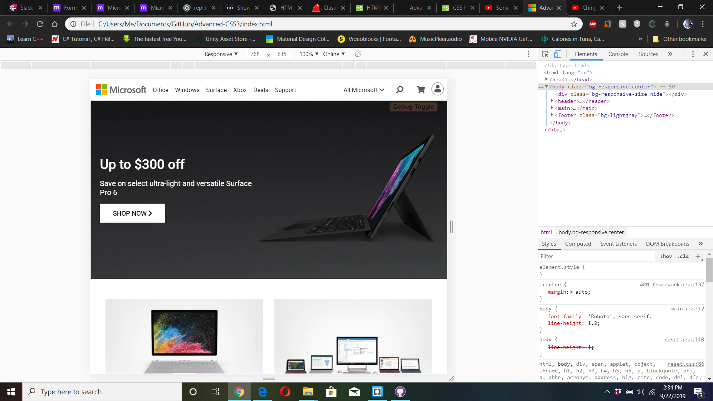
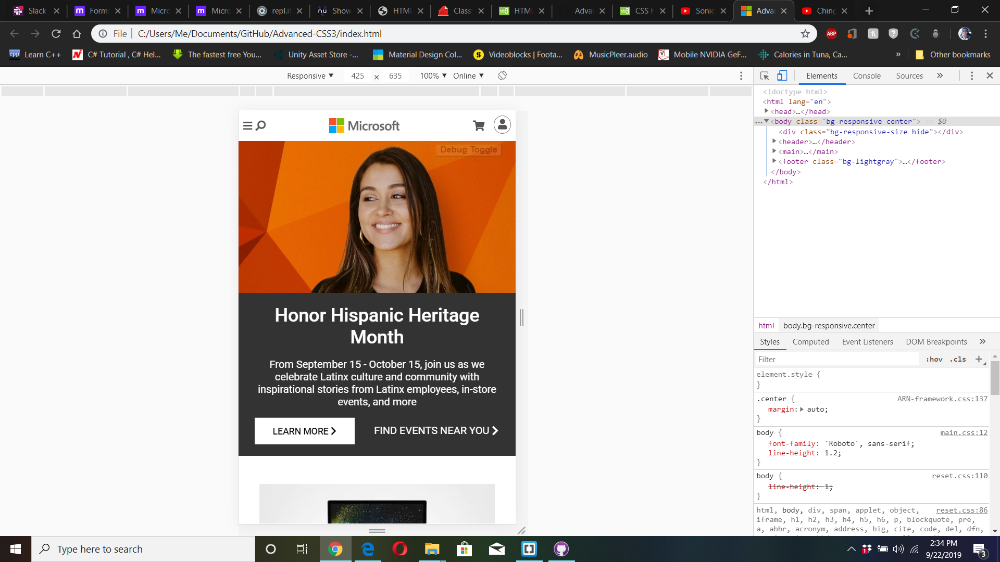

# Advanced-CSS3
In this final project, you’ll get to take everything you’ve learned and use it to build your own simple 12 column grid-based framework.

I recreated the [__Microsoft.com__](https://www.microsoft.com/en-us/) website using the __Custom Built Framework__.





## [Live Link](https://raw.githack.com/Aaron-RN/Advanced-CSS3/master/index.html)

## Built With

- HTML5, CSS
- JavaScript

# Features
A 12-column Grid based responsive system.

Breakpoints for Screen Sizes:  
- Small = 720px width and below,
- Medium = 721px width to 1023px width
- Large = 1024px width and above

## Simple Use

**Three (3) Main classes: .container, .row and .col-\*-m\*-\***

### .container
The .container class sets the element at a specified max width with 5% paddings on the left and right sides. It also removes wrapping and hides overflown content.

### .row
The .row class which can be placed as a child of a container, returns the wrapping of contents and is a relative positioned element and takes up 100% of the view width space.

There are two variations of the .row class, .row-flex and .row-flex-auto

#### .row-flex
The .row-flex class turns the element into a flex-box that spans the entire width of its parent element

#### .row-flex-auto
The .row-flex-auto class turns the element into a flex-box that has an auto expanding width(width of element is relative to its children's width). 

### .col-\*
The .col-\*-m\*-\* class has a few variations to: .col-\*, .col-\*-md, .col-\*-sm.

The .col-\* variant sets the column size for the element to one value for all screen sizes. The \* is replaced with one of the numbers from 1 - 12.

#### .col-\*-md
The .col-\*-md variant sets the column size for the element to the given value (ranging from 1-12) as the column size for medium screens.

#### .col-\*-sm
The .col-\*-sm variant sets the column size for the element to the given value (ranging from 1-12) as the column size for small screens.

**Example combining the 3 variants :** `<div class="col-2 col-3-md col-4-sm"></div>`

### .col-\*-m\*-\*
The .col-\*-m\*-\* variant takes all three variables into one class-name as .col-lg-m(md)-sm. The first variable addresses the column size for large screens, the second variable addresses the column size for medium screens and the last variable addresses the column size for the small screens.

__Example :__ `<div class="col-2-m3-12"></div>`

### Mobile Navigation Bar

### How to use:

#### Add a div within the body tag with id="#navOverlay" and class=".hide"

```
<body>
  <div id="navOverlay" class="hide"></div>
</body>
```

#### Add id="#mobileNav" to which ever element will be used as a button to open up the mobile responsive navigation bar
In this example the id is placed on a div containing a bars icon provided by font-awesome.

```
<div id="mobileNav" class="col px-1"><a href="#"><i class="fas fa-bars size-26"></i></a></div>
```

#### Add div element container with id="#navDropDownMenu" and class=".hide"
The anchor links will be added as child elements within this created div.

```
<div id="navDropDownMenu" class="hide">
  <a href="#">Link 1</a>
  <a href="#">Link 2</a>
  <a href="#">Link 3</a>
  <a href="#">Link 4</a>
</div>
```
#### *Note: 
The navigationbar icon is automatically changed within NavMenu.js. If you wanted to choose a different icon you would have to edit lines 5 and 6.

```
...
const navOpen = '<a href="#"><i class="fas fa-times size-34"></i></a>';
const navClose = '<a href="#"><i class="fas fa-bars size-26"></i></a>';
...
```

### Built-in Slider
At the moment the framework only allows for one working slider per page. The variables for the slider are changed and accessed by creating these custom CSS variables in your own custom CSS file: 

```
  :root {
    --slideTimer: 5;
    --slideTitle-1: Honor Hispanic Heritage Month; 
    --slideTitle-2: Up to $300 off;
    --slideDesc-1: From September 15 - October 15, join us as we celebrate Latinx culture and community with inspirational stories from       Latinx employees, in-store events, and more;
    --slideDesc-2: Save on select ultra-light and versatile Surface Pro 6;
  }
```
Of course the values given in these CSS variables are just for example purposes.

#### --slideTimer
This variable controls the amount of time in seconds it takes each slider image to rotate.

#### --slideTitle-1
This variable contains text which is shown as the title of the first slide.

#### --slideTitle-2
This variable contains text which is shown as the title of the second slide.

#### --slideDesc-1
This variable contains text which is shown as the description of the first slide.

#### --slideDesc-2
This variable contains text which is shown as the description of the second slide.

Slider background images are supplied using the classes 'bg-slide-1' and 'bg-slide-2'. *Media responsive queries should be used to determine if alternate background images are given based on the screen size.*

**Classes found in CSS file**

```
/* SLIDER */
.bg-slide-1 { background-image: url(../images/slide1.webp); }
.bg-slide-2 { background-image: url(../images/slide2.webp); }
```

**Example slider code in HTML :**

```
<div id="slideBG" class="col-12 bg-jumbo bg-slide-1">
 <div class="container">
  <div class="col-6">
    <h class="slideTitle">Honor Hispanic Heritage Month</h>
    <p class="slideDesc">From September 15-October 15, join us as we celebrate Latinx culture and community with inspirational stories       from Latinx employees, in-store events, and more</p>
    <div class="slideButtons row m-t-15">
      <a href="#" class="col button">LEARN MORE</a>
    </div>
  </div>
 </div>
</div>
```

#### .slideButtons
This class contains any html coding related to the buttons available in each slide. However, for now, in-order to change the information in this class the ChangeSlide() function found within the slide.js file must be edited.

### Animations
Includes 5 pre-made animations: grow, grow:hover, slideUp, slideLeft, slideLeft:hover

__animate-grow__ - selected element grows and shrinks in a pulsating fashion  
__animate-grow-hover__ - selected element grows on hover and shrinks when not hovered over  
__animate-slideUp__ - element slides up from bottom of screen  
__animate-slideLeft__ - element slides from the right to left  
__animate-slideLeft-hover__ - element slides from the righ to left on hover

### Display Features
For screen size references refer to Features section above on section related to Breakpoints.

__.hide__ - element is hidden  
__.hide-sm__ - block element is hidden on small screens  
__.hide-sm-inline__ - inline-block element is hidden on small screens  
__.hide-sm-flex__ - flex-box element is hidden on small screens  
__.hide-md__ - block element is hidden on medium screens  
__.hide-md-inline__ - inline-block element is hidden on medium screens  
__.hide-md-flex__ - flex-box element is hidden on medium screens  
__.hide-lg__ - block element is hidden on large screens  
__.hide-lg-inline____ - inline-block element is hidden on large screens  
__.hide-lg-flex__ - flex-box element is hidden on large screens  

__.show-sm-only__ - element is hidden on both large and medium screens  
__.show-sm-only-inline__ - inline-block element is hidden on both large and medium screens  
__.show-sm-only-flex__ - flex-box element is hidden on both large and medium screens  

__.inline-block__ { display: inline-block; }  

### TEXT DECORATIONS and TRANSFORMS

__.underline__ { text-decoration: underline; }  
__.uppercase__ { text-transform: uppercase; }  
__.smallcaps__ { font-variant: small-caps; }  
__.text-strikeout__ { text-decoration: line-through; }  
__.bold__ { font-weight: 700; }  
__.bold-100__ { font-weight: 100; }  
__.bold-200__ { font-weight: 200; }  
__.bold-300__ { font-weight: 300; }  
__.bold-400__ { font-weight: 400; }  
__.bold-500__ { font-weight: 500; }  
__.bold-600__ { font-weight: 600; }  
__.bold-800__ { font-weight: 800; }  
__.bold-900__ { font-weight: 900; }  
__.italic__ { font-style: italic; }  

### FONT SIZES

__.size-6__ { font-size: 0.375em; }  
__.size-8__ { font-size: 0.5em; }  
__.size-10__ { font-size: 0.625em; }  
__.size-12__ { font-size: 0.75em; }  
__.size-13__ { font-size: 0.8125em; }  
__.size-14__ { font-size: 0.875em; }  
__.size-15__ { font-size: 0.9em; }  
__.size-16__ { font-size: 1em; }  
__.size-18__ { font-size: 1.125em; }  
__.size-20__ { font-size: 1.25em; }  
__.size-22__ { font-size: 1.375em; }  
__.size-24__ { font-size: 1.5em; }  
__.size-26__ { font-size: 1.625em; }  
__.size-28__ { font-size: 1.75em; }  
__.size-30__ { font-size: 1.875em; }  
__.size-32__ { font-size: 2em; }  
__.size-34__{ font-size: 2.125em; }  
__.size-36__ { font-size: 2.25em; }  
__.size-38__ { font-size: 2.375em; }  
__.size-40__ { font-size: 2.5em; }  
__.size-46__ { font-size: 2.875em; }  
__.size-50__ { font-size: 3.125em; }  

### LINE HEIGHTS

__.lineH-1-2__ { line-height: 1.2; }  
__.lineH-1-3__ { line-height: 1.3; }  
__.lineH-1-4__ { line-height: 1.4; }  
__.lineH-20__ { line-height: 20px; }  
__.lineH-30__ { line-height: 30px; }  
__.lineH-70__ { line-height: 70px; }  

### Text Colors

__.text-black__ { color: #000; }  
__.text-white__ { color: #fff; }  
__.text-mute__ { color: #aaa; }  
__.text-gray__ { color: #6f6f6f; }  
__.text-dark__ { color: #555; }  
__.text-red__ { color: #ff4d4d; }  
__.text-blue__ { color: #0073e6; }  
__.text-green__ { color: #11af11; }  
__.text-yellow__ { color: #efa611; }  
__.text-orange__ { color: #f71; }  

### BACKGROUNDS

__.bg-none__ { background: transparent; }  
__.bg-white__ { background-color: #fff; }  
__.bg-black__ { background-color: #000; }  
__.bg-gray__ { background-color: #aaa; }  
__.bg-darkgray__ { background-color: #333; }  
__.bg-red__ { background-color: #a11; }  
__.bg-lightgray__ { background-color: #f2f2f2; }  
__.bg-jumbo__ - non-repeating background image, that covers the entire element width and height while centered which resizes depending on the view width of the browser.

### WIDTH AND HEIGHT

__.width-max__ { width: 100%; }  
__.height-30__ { min-height: 30px; }  
__.height-50__ { min-height: 50px; }  
__.height-100__ { min-height: 100px; }  
__.height-250__ { min-height: 250px; }  
__.height-300__ { min-height: 300px; }  
__.height-500__ { min-height: 500px; }  
__.height-max__ { height: 100%; }  

### BORDERS

__.border__ { border: 1px gray solid; }  
__.border-2__ { border: 2px gray solid; }  
__.border-3__ { border: 3px gray solid; }  
__.border-r-0__ { border-right: none; }  
__.border-l-0__ { border-left: none; }  
__.border-t-0__ { border-top: none; }  
__.border-b-0__ { border-bottom: none; }  
__.border-circle__ { border-radius: 50%; }  
__.border-rad-10__ { border-radius: 10px; }  
__.border-white__ { border-color: #fff; }  
__.border-black__ { border-color: #000; }  
__.border-red__ { border-color: #c00; }  

### MARGINS

__.m-t-1__ { margin-top: 1em; }  
__.m-t-2__ { margin-top: 2em; }  
__.m-t-3__ { margin-top: 3em; }  
__.m-t-4__ { margin-top: 4em; }  
__.m-t-10__ { margin-top: 10px; }  
__.m-t-15__ { margin-top: 15px; }  
__.m-t-20__ { margin-top: 20px; }  

__.m-b-1__ { margin-bottom: 1em; }  
__.m-b-2__ { margin-bottom: 2em; }  
__.m-b-3__ { margin-bottom: 3em; }  
__.m-b-10__ { margin-bottom: 10px; }  

__.m-l-1__ { margin-left: 1em; }  
__.m-l-2__ { margin-left: 2em; }  
__.m-l-3__ { margin-left: 3em; }  
__.m-l-20__ { margin-left: 20px; }  

__.m-r-1__ { margin-right: 1em; }  
__.m-r-2__ { margin-right: 2em; }  
__.m-r-3__ { margin-right: 3em; }  

__.margin-l-auto__ { margin-left: auto; }  
__.margin-r-auto__ { margin-right: auto; }

### PADDINGS

__.p-0__ { padding: 0 !important; }  
__.p-5__ { padding: 5px; }  
__.p-10__ { padding: 10px; }  
__.p-15__ { padding: 15px; }  
__.p-20__ { padding: 20px; }  
__.p-5-child div__ { padding: 5px; }  
__.p-5-child-md div__ { padding: 5px; }  
__.p-10-child div__ { padding: 10px; }  
__.p-15-child div__ { padding: 15px; }  

__.p-l-1__ { padding-left: 1em; }  
__.p-l-2__ { padding-left: 2em; }  
__.p-l-3__ { padding-left: 3em; }  
__.p-l-5__ { padding-left: 5px !important; }  

__.p-r-1__ { padding-right: 1em; }  
__.p-r-2__ { padding-right: 2em; }  
__.p-r-3__ { padding-right: 3em; }  

__.p-t-1__ { padding-top: 1em; }  
__.p-t-2__ { padding-top: 2em; }  
__.p-t-3__ { padding-top: 3em; }  
__.p-t-10__ { padding-top: 10px; }  
__.p-t-15__ { padding-top: 15px; }  
__.p-t-20__ { padding-top: 20px; }  

__.p-b-1__ { padding-bottom: 3em; }  
__.p-b-2__ { padding-bottom: 3em; }  
__.p-b-3__ { padding-bottom: 3em; }  
__.p-b-3px__ { padding-bottom: 3px !important; }  
__.p-b-10__ { padding-bottom: 10px; }  
__.p-b-15__ { padding-bottom: 15px; }  
__.p-b-20__ { padding-bottom: 20px; }  

### POSITIONINGS

__.pos-relative__ { position: relative; }  
__.pos-absolute__ { position: absolute; }  
__.width-auto__ { width: auto; }  
__.center__ { margin: auto; }  
__.center-text__ { text-align: center; }  
__.vert-mid, .vert-mid \*__ { vertical-align: middle; align-self: center; }  
__.vert-top, .vert-top \*__ { vertical-align: top; align-self: flex-start; }  
__.vert-btm, .vert-btm \*__ { vertical-align: bottom; align-self: flex-end; }  
__.vert-stretch, .vert-stretch \*__ { vertical-align: middle; align-self: stretch; height: 100%; }  
__.vert-middle__ { top: 50%; transform: translateY(-50%); }

### Future Features

- Convert grid system to a flex-box based system

## Author

👤 **Aaron Rory**

- GitHub: [@Aaron-RN](https://github.com/Aaron-RN)
- Twitter: [@ARNewbold](https://twitter.com/ARNewbold)
- Linkedin: [Aaron Newbold](https://www.linkedin.com/in/aaron-newbold-1b9233187/)

## 🤝 Contributing

Contributions, issues and feature requests are welcome!

Feel free to check the [issues page](issues/).

## Show your support

Give a ⭐️ if you like this project!

## 📝 License

This project is [MIT](lic.url) licensed.


